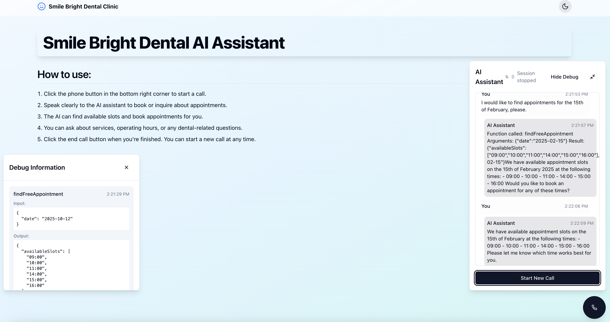

# openai_mongodb_realtime_agent
## Overview

This project integrates OpenAI with MongoDB to create a realtime agent application for voice-enabled communications. It leverages WebRTC for audio streaming and uses MongoDB's realtime capabilities to process and display data on the fly



## Features
- Voice communication via WebRTC
- OpenAI integration for advanced language processing
- Realtime data updates with MongoDB
- Scalable and modular architecture

## Installation
1. Clone this repository.
2. Install dependencies:
    ```
    npm install
    ```
3. Create a `.env` file and set the following variables:
    - MONGODB_URI
    - OPENAI_API_KEY

## Extending Tools with tools.ts

Instead of listing and configuring tools in your main configuration file, you can extend your agent by directly modifying the tools in the tools.ts file. This centralizes the tool definitions and their implementations.

### 1. Define Your Tool

Open the tools.ts file and add your tool information to the tools array. For example, to add a tool for finding free appointments, include an entry like:

```typescript
export const tools: Tool[] = [
    {
        type: "function",
        name: "findFreeAppointment",
        description: "Find the next available appointment slot",
        parameters: {
            type: "object",
            properties: {
                date: {
                    type: "string",
                    description: "The date to start searching from (YYYY-MM-DD)"
                }
            },
            required: ["date"]
        }
    },
    // add more tools here
]
```

### 2. Implement the Tool's Functionality

Next, implement the tool's logic in the toolFunctions object within the same file:

```typescript
export const toolFunctions: Record<string, ToolFunction> = {
    findFreeAppointment: async ({ date }) => {
        const response = await fetch(`/api/appointments?date=${date}`);
        if (!response.ok) {
            throw new Error('Failed to fetch appointments');
        }
        const appointments = await response.json();
        return appointments;
    },
    // add additional tool implementations here
}
```

### 3. Integrate Tools During Application Startup

Ensure that your application imports the tools and toolFunctions from tools.ts and initializes them at startup. This way, every new tool you add is automatically available to your agent.

With this approach, extending your agent with new functionality involves simply defining a new tool and its corresponding function in a central location. This improves modularity and keeps your configuration organized.


## Usage
1. Start the server:
    ```
    npm run dev
    ```
2. Open your browser and navigate to the specified PORT.
3. Use the voice interface to interact with the realtime agent.

## Build and run
1. Build the project
```
npm run build
```
2. Run application
```
npm start
```

## Contributing
Contributions are welcome. Please submit pull requests for any enhancements or bug fixes.

## License
This project is licensed under the MIT License.